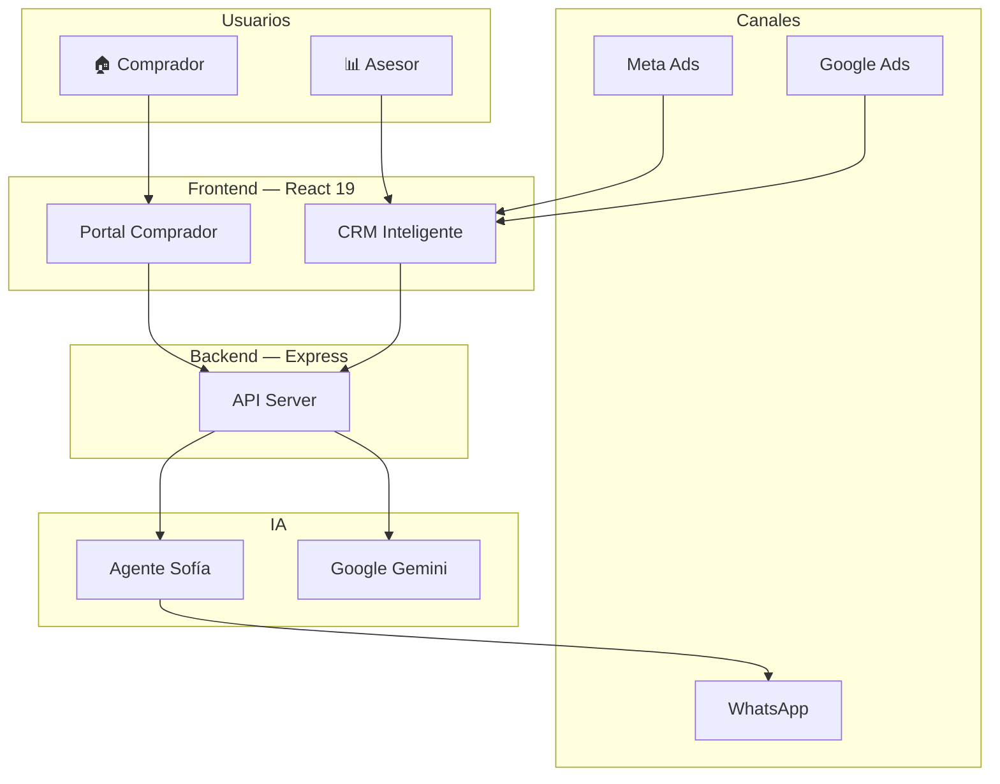

<p align="center">
  
</p>

<h1 align="center">🏠 Colsubsidio Lead Intelligence</h1>

<p align="center">
  <strong>Plataforma CRM inteligente con IA para la gestión de leads inmobiliarios de Colsubsidio Vivienda</strong>
</p>

<p align="center">
  
  
  
  
  
  
</p>

---

## 📋 Descripción

**Colsubsidio Lead Intelligence** es un ecosistema dual que combina:

1. **CRM Inteligente para Asesores Comerciales** — Dashboard con scoring IA (Score 360), gestión de leads, pipeline de negocios, buyer personas con clustering ML, remarketing automatizado e integración con WhatsApp a través del agente IA Sofía.

2. **Portal Público para Compradores** — Catálogo de proyectos de vivienda, simulador de subsidios VIS/Mi Casa Ya, y asistente de vivienda potenciado por Google Gemini.

---

## ✨ Características Principales

### 🤖 Inteligencia Artificial
- **Score 360**: Scoring multidimensional (Fit, Intent, Engagement, Conversion) ponderado de 0-100
- **Agente Sofía**: Bot IA de WhatsApp para perfilamiento automático de leads (n8n + Baileys + GPT-4o)
- **Buyer Personas IA**: Clustering K-Means sobre 4,142+ compradores históricos
- **Next Best Action**: Recomendación automática de la siguiente mejor acción por lead
- **Generador de Copy IA**: Creación de copys publicitarios con Google Gemini y variantes A/B
- **Asistente de Vivienda**: Chatbot IA con conocimiento de subsidios, proyectos y financiación

### 📊 Analytics y Visualización
- Funnel de conversión interactivo
- Heatmap de intención de compra
- Comparación de canales (Meta, Google, TikTok)
- Matriz de priorización de leads
- Evolución temporal de scores
- Customer Journey Timeline

### 💼 Gestión Comercial
- Pipeline Kanban de negocios (5 etapas)
- Gestión de tareas diarias del asesor
- Sistema de alertas y escalación automática
- Catálogo de proyectos con mapas (Leaflet)
- Templates de WhatsApp y secuencias de remarketing

### 🔗 Integración WhatsApp
- Handoff bidireccional Sofía ↔ Asesor
- Historial de conversaciones en tiempo real
- Envío de mensajes desde el CRM
- Polling automático cada 10 segundos

---

## 🛠️ Stack Tecnológico

| Capa | Tecnología |
|------|-----------|
| Frontend | React 19, TypeScript, Vite 6, Tailwind CSS 4, Motion |
| Visualización | Recharts, Leaflet, Lucide React |
| Backend | Express.js, Node.js |
| IA (Público) | Google Gemini 3.6 Flash |
| IA (WhatsApp) | GPT-4o / Claude (via n8n + Baileys) |
| Despliegue | Vercel / Google AI Studio |

---

## 🚀 Inicio Rápido

### Requisitos
- Node.js ≥ 22.x
- npm ≥ 10.x

### Instalación

```bash
# Clonar el repositorio
git clone https://github.com/CristianCastaGu/colsubsidio-lead-intelligence.git
cd colsubsidio-lead-intelligence

# Instalar dependencias
npm install

# Configurar variables de entorno
cp .env.example .env
# Editar .env con tu GEMINI_API_KEY (opcional)

# Iniciar en modo desarrollo
npm run dev
```

La aplicación estará disponible en **http://localhost:3000**

### Build de Producción

```bash
npm run build
npm run start
```

---

## 📁 Estructura del Proyecto

```
colsubsidio-lead-intelligence/
├── src/
│   ├── advisor/                    # 📊 CRM del Asesor Comercial
│   │   ├── AdvisorApp.tsx          #    Shell principal
│   │   ├── types.ts                #    Modelos de datos
│   │   ├── components/
│   │   │   ├── views/              #    11 vistas modulares
│   │   │   ├── analytics/          #    12 componentes Recharts
│   │   │   ├── modals/             #    Modales interactivos
│   │   │   ├── Header.tsx
│   │   │   └── Sidebar.tsx
│   │   ├── data/                   #    Datasets y mappers
│   │   ├── hooks/                  #    Custom hooks (polling)
│   │   └── utils/                  #    Lógica de scoring
│   ├── buyer/                      # 🏠 Portal del Comprador
│   ├── RoleSelector.tsx            #    Selector de rol
│   └── App.tsx                     #    Entry point
├── server.ts                       # 🖥️ Servidor Express + APIs
├── lib/
│   └── sofiaClient.ts              #    Cliente proxy Sofía
├── api/                            # ☁️ Serverless (Vercel)
├── docs/                           # 📚 Documentación
│   ├── 01-ARQUITECTURA.md
│   ├── 02-MODULOS-FUNCIONALES.md
│   ├── 03-MODELO-DATOS.md
│   ├── 04-API-ENDPOINTS.md
│   ├── 05-SCORING-LEAD-INTELLIGENCE.md
│   ├── 06-GUIA-INSTALACION.md
│   ├── 07-VARIABLES-ENTORNO.md
│   └── sofia-whatsapp-agent/       # 🤖 Docs del Agente Sofía
├── public/                         #    Assets estáticos
├── package.json
├── tsconfig.json
├── vite.config.ts
└── .env.example
```

---

## 📚 Documentación

La documentación completa del proyecto se encuentra en la carpeta [`docs/`](./docs/):

| Documento | Descripción |
|-----------|-------------|
| [📐 Arquitectura](./docs/01-ARQUITECTURA.md) | Stack, diagramas de componentes, flujo de datos |
| [📦 Módulos Funcionales](./docs/02-MODULOS-FUNCIONALES.md) | Descripción de las 11 vistas del CRM |
| [📐 Modelo de Datos](./docs/03-MODELO-DATOS.md) | Interfaces TypeScript y contratos de datos |
| [🔌 API Endpoints](./docs/04-API-ENDPOINTS.md) | Endpoints REST, request/response, proxy Sofía |
| [🎯 Scoring & Lead Intelligence](./docs/05-SCORING-LEAD-INTELLIGENCE.md) | Score 360, previabilidad, NBA |
| [🚀 Guía de Instalación](./docs/06-GUIA-INSTALACION.md) | Setup local, build, despliegue |
| [🔐 Variables de Entorno](./docs/07-VARIABLES-ENTORNO.md) | Configuración de API keys |
| [🤖 Agente Sofía (WhatsApp)](./docs/sofia-whatsapp-agent/README.md) | Documentación completa del agente IA |

---

## 🤖 Agente Sofía — IA WhatsApp

Sofía es el agente conversacional de IA que atiende leads por WhatsApp. Su documentación completa se encuentra en [`docs/sofia-whatsapp-agent/`](./docs/sofia-whatsapp-agent/).

### Capacidades
- Perfilamiento automático de leads por conversación natural
- Calificación con scoring (Hot / Warm / Cold)
- Recomendación de proyectos según perfil financiero
- Generación de brief ejecutivo para el asesor
- Handoff fluido a asesores humanos
- Envío de brochures y cotizaciones

### Arquitectura
```
WhatsApp → Baileys → n8n (Orquestador) → GPT-4o / Claude → API CRM
```

---

## 📜 Scripts

| Script | Comando | Descripción |
|--------|---------|-------------|
| Dev | `npm run dev` | Servidor de desarrollo con HMR |
| Build | `npm run build` | Build de producción |
| Start | `npm run start` | Servidor de producción |
| Preview | `npm run preview` | Preview del build |
| Clean | `npm run clean` | Limpiar build |
| Lint | `npm run lint` | Verificación de tipos |

---

## 🏗️ Arquitectura de Alto Nivel



---

## 📄 Licencia

Proyecto privado de Colsubsidio. Todos los derechos reservados.

---

<p align="center">
  Desarrollado con ❤️ para <strong>Colsubsidio Vivienda</strong>
</p>


---

## Demo en Vercel

La aplicacion esta disponible en [colsubsidio-lead-intelligence.vercel.app](https://colsubsidio-lead-intelligence.vercel.app/). Los cambios enviados a la rama main activan un nuevo despliegue en Vercel.

## Ultima actualizacion funcional

- Informe de Buyer Personas para Marketing: cuatro segmentos historicos con señales, canales, fricciones, financiacion y activacion recomendada.
- Handoff bidireccional en WhatsApp: el asesor puede retomar una conversacion o devolverla a Sofia.

- Simulador local de Sofia: demo autocontenida de perfilamiento y cotizacion, sin depender del canal real de WhatsApp.
