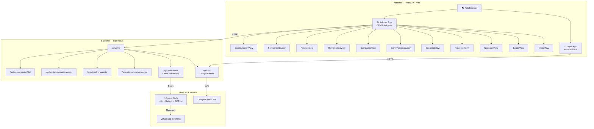

# 🏗️ Arquitectura del Sistema

## Visión General

**Colsubsidio Lead Intelligence** es una plataforma dual compuesta por un **CRM inteligente para asesores comerciales** y un **portal público para compradores** de vivienda, potenciada por inteligencia artificial para optimizar la conversión de leads inmobiliarios.

---

## Stack Tecnológico

| Capa | Tecnología | Versión | Propósito |
|------|-----------|---------|-----------|
| **Frontend** | React | 19.1 | Librería UI con composición de componentes |
| **Lenguaje** | TypeScript | 5.8 | Tipado estático para seguridad en desarrollo |
| **Bundler** | Vite | 6.4 | Build tool ultra-rápido con HMR |
| **Estilos** | Tailwind CSS | 4.1 | Utility-first CSS framework |
| **Animaciones** | Motion (Framer Motion) | 12.x | Animaciones fluidas y micro-interacciones |
| **Iconos** | Lucide React | 0.546 | Iconografía moderna y consistente |
| **Gráficas** | Recharts | 3.10 | Visualización de datos y analytics |
| **Mapas** | Leaflet + React Leaflet | 1.9 / 5.0 | Mapas interactivos de proyectos |
| **Backend** | Express.js | 4.x | Servidor HTTP con API proxy |
| **IA (Público)** | Google Gemini 3.6 Flash | 2.4 | Asistente de vivienda para compradores |
| **IA (WhatsApp)** | GPT-4o / Claude | — | Agente Sofía para perfilamiento automático |
| **Runtime** | Node.js | 22+ | Entorno de ejecución del servidor |

---

## Diagrama de Arquitectura



---

## Flujo de Datos

### 1. Captura de Leads
```
Pauta Digital (Meta/Google/TikTok)
    ↓
Landing Page → Formulario
    ↓
Base de Datos de Leads (4,142+ registros históricos)
    ↓
Score 360 (cálculo automático)
    ↓
Dashboard del Asesor (InicioView)
```

### 2. Perfilamiento por IA (Sofía)
```
Lead responde a pauta → WhatsApp
    ↓
Agente Sofía (n8n + GPT-4o)
    ↓
Conversación de calificación automática
    ↓
Perfil sociodemográfico + intención de compra
    ↓
Score Sofía → Sincronización con CRM
    ↓
Asesor toma control (handoff) o Sofía continúa
```

### 3. Pipeline Comercial
```
Lead calificado (Score 360 ≥ 60)
    ↓
Asignación a Asesor → Tarea Comercial
    ↓
Contacto → Cita en Sala de Ventas
    ↓
Pre-Aprobación Financiera
    ↓
Promesa de Compraventa
    ↓
Cierre Exitoso
```

---

## Estructura de Carpetas

```
colsubsidio-lead-intelligence/
├── src/
│   ├── advisor/                    # Aplicación CRM del Asesor
│   │   ├── AdvisorApp.tsx          # Shell principal con sidebar + routing
│   │   ├── types.ts                # Modelos de datos TypeScript
│   │   ├── components/
│   │   │   ├── Header.tsx          # Barra superior
│   │   │   ├── Sidebar.tsx         # Navegación lateral
│   │   │   ├── analytics/          # 12 componentes Recharts
│   │   │   ├── icons/              # Iconos personalizados (WhatsApp)
│   │   │   ├── modals/             # Modales flotantes
│   │   │   └── views/              # 11 vistas modulares
│   │   ├── data/                   # Datasets mock y mappers
│   │   ├── hooks/                  # Custom hooks (polling Sofía, WhatsApp)
│   │   └── utils/                  # Lógica de scoring y escalación
│   ├── buyer/                      # Aplicación portal del Comprador
│   ├── RoleSelector.tsx            # Selector de rol inicial
│   ├── App.tsx                     # Entry point React
│   └── index.css                   # Estilos globales + Tailwind
├── server.ts                       # Servidor Express + proxy Sofía + Gemini
├── lib/
│   └── sofiaClient.ts              # Cliente HTTP para API de Sofía
├── api/                            # Serverless functions (Vercel)
├── public/                         # Assets estáticos
├── docs/                           # 📚 Documentación del proyecto
│   ├── sofia-whatsapp-agent/       # Docs del Agente Sofía
│   └── ...
├── data-raw/                       # Datasets originales
├── package.json
├── tsconfig.json
├── vite.config.ts
└── .env.example
```

---

## Patrones de Diseño Utilizados

| Patrón | Implementación |
|--------|---------------|
| **Component Composition** | Vistas modulares independientes con estado local |
| **Lifting State Up** | `AdvisorApp.tsx` como state container principal |
| **Custom Hooks** | `useSofiaLeads`, `useWhatsAppConversation` para polling |
| **Proxy Pattern** | `server.ts` como proxy entre frontend y API de Sofía |
| **Rule-Based Fallback** | Respuestas inteligentes cuando Gemini API no está disponible |
| **Portal Pattern** | Modales flotantes con `createPortal` para posicionamiento correcto |
| **Score Decomposition** | Score 360 descompuesto en 4 dimensiones (Fit, Intent, Engagement, Conversion) |

---

> **Ver también:** [Módulos Funcionales](./02-MODULOS-FUNCIONALES.md) · [Modelo de Datos](./03-MODELO-DATOS.md) · [API Endpoints](./04-API-ENDPOINTS.md)
