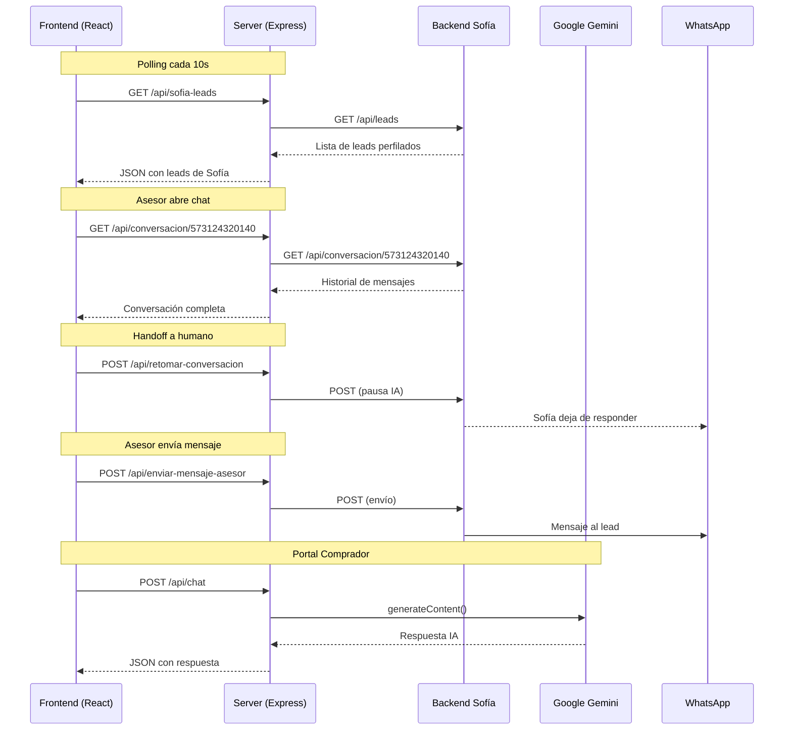

# 🔌 API Endpoints

Documentación de los endpoints del servidor Express.js que alimentan el frontend del CRM y actúan como proxy para el Agente Sofía.

**Archivo fuente:** `server.ts`  
**Puerto:** `3000` (desarrollo local)

---

## Endpoints Públicos

### `GET /api/health`

Health check del servidor.

**Respuesta:**
```json
{
  "status": "ok"
}
```

---

### `POST /api/chat`

Asistente de vivienda IA (Google Gemini) para el portal público del comprador.

**Request Body:**
```json
{
  "message": "¿Qué subsidios hay disponibles para vivienda VIS?",
  "history": [
    { "role": "user", "parts": [{ "text": "Hola" }] },
    { "role": "model", "parts": [{ "text": "¡Bienvenido!" }] }
  ]
}
```

**Respuesta exitosa (200):**
```json
{
  "response": "Colsubsidio ofrece subsidios VIS para familias con ingresos de hasta 4 SMMLV..."
}
```

**Fallback (sin API key):**  
Cuando `GEMINI_API_KEY` no está configurada, el sistema utiliza un motor de respuestas basado en reglas que cubre los temas más frecuentes sobre subsidios, proyectos y requisitos.

---

## Endpoints del Agente Sofía (Proxy)

Todos los endpoints de Sofía actúan como proxy server-to-server hacia el backend de Sofía, evitando restricciones CORS del navegador.

**Base URL del backend Sofía:** Configurada en `lib/sofiaClient.ts`

---

### `GET /api/sofia-leads`

Obtiene la lista de leads capturados y perfilados por el Agente Sofía en WhatsApp.

**Polling:** El frontend ejecuta esta llamada cada **10 segundos** via el hook `useSofiaLeads.ts`.

**Respuesta (200):**
```json
[
  {
    "lead_id": "sofia-001",
    "nombre": "María Rodríguez",
    "telefono": "573124320140",
    "fuente": "WhatsApp Directo",
    "score": "hot",
    "score_numerico": 82,
    "es_afiliado": true,
    "categoria_afiliado": "B",
    "rango_salarial": "2 a 4 SMMLV",
    "primera_vivienda": true,
    "proyecto_interes_original": "Ciudadela Maiporé",
    "proyecto_recomendado": ["Ciudadela Maiporé", "Calia"],
    "brief_asesor": "Lead calificado con alta intención. Afiliada Cat B, primera vivienda...",
    "timestamp": "2026-07-25T14:30:00Z"
  }
]
```

**Error (500):**
```json
{
  "error": "No se pudieron obtener los leads de Sofía",
  "details": "Connection timeout"
}
```

---

### `GET /api/conversacion/:telefono`

Obtiene el historial completo de la conversación de WhatsApp entre Sofía y un lead.

**Parámetros de URL:**
| Parámetro | Tipo | Descripción |
|-----------|------|-------------|
| `telefono` | string | Número de teléfono en formato internacional (ej: `573124320140`) |

**Respuesta (200):**
```json
{
  "conversacion": [
    {
      "rol": "agente",
      "mensaje": "¡Hola! Soy Sofía, asistente de vivienda de Colsubsidio 🏠",
      "timestamp": "2026-07-25T14:00:00Z"
    },
    {
      "rol": "usuario",
      "mensaje": "Hola, me interesa información sobre Maiporé",
      "timestamp": "2026-07-25T14:01:30Z"
    }
  ],
  "leadInfo": {
    "nombre": "María Rodríguez",
    "score": "hot",
    "estado": "activo"
  }
}
```

---

### `POST /api/retomar-conversacion`

El asesor humano toma el control del chat de WhatsApp que llevaba Sofía (handoff IA → Humano).

**Request Body:**
```json
{
  "telefono": "573124320140",
  "asesor": "Carlos Gómez"
}
```

**Respuesta (200):**
```json
{
  "success": true,
  "message": "Conversación retomada por el asesor"
}
```

**Efecto:** Sofía deja de responder automáticamente a este número hasta que se devuelva el control.

---

### `POST /api/enviar-mensaje-asesor`

Envía un mensaje del asesor al lead a través del canal de WhatsApp de Sofía.

**Request Body:**
```json
{
  "telefono": "573124320140",
  "mensaje": "Buenos días María, le confirmo su cita para mañana a las 10am en la sala de ventas de Maiporé.",
  "asesor": "Carlos Gómez"
}
```

**Respuesta (200):**
```json
{
  "success": true,
  "message": "Mensaje enviado exitosamente"
}
```

---

### `POST /api/devolver-agente`

Devuelve el control de la conversación al Agente Sofía (Handoff Humano → IA).

**Request Body:**
```json
{
  "telefono": "573124320140"
}
```

**Respuesta (200):**
```json
{
  "success": true,
  "message": "Conversación devuelta al agente IA"
}
```

**Efecto:** Sofía reanuda las respuestas automáticas para este número.

---

## Diagrama de Flujo de API



---

## Headers Requeridos

### Para endpoints de Sofía (servidor)
```
ngrok-skip-browser-warning: true
Content-Type: application/json
```

### Para endpoints públicos (cliente)
```
Content-Type: application/json
```

---

## Funciones Serverless (Vercel)

Para producción, los mismos endpoints están disponibles como funciones serverless en la carpeta `api/`:

| Archivo | Endpoint equivalente |
|---------|---------------------|
| `api/chat.js` | `POST /api/chat` |
| `api/sofia-leads.js` | `GET /api/sofia-leads` |
| `api/retomar-conversacion.js` | `POST /api/retomar-conversacion` |
| `api/devolver-agente.js` | `POST /api/devolver-agente` |
| `api/enviar-mensaje-asesor.js` | `POST /api/enviar-mensaje-asesor` |
| `api/conversacion/[telefono].js` | `GET /api/conversacion/:telefono` |

---

> **Ver también:** [Arquitectura](./01-ARQUITECTURA.md) · [Modelo de Datos](./03-MODELO-DATOS.md) · [Agente Sofía](./sofia-whatsapp-agent/README.md)
