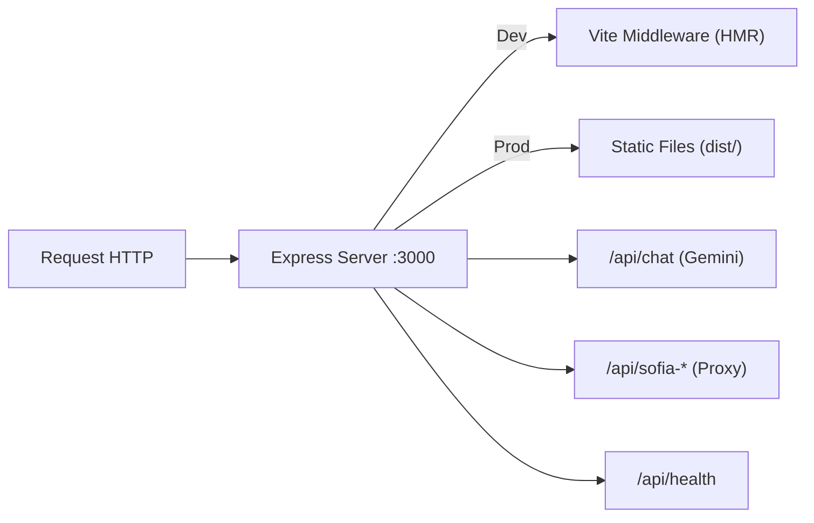

# 🚀 Guía de Instalación y Despliegue

## Requisitos Previos

| Software | Versión Mínima | Verificar |
|----------|---------------|-----------|
| **Node.js** | 22.x | `node --version` |
| **npm** | 10.x | `npm --version` |
| **Git** | 2.x | `git --version` |

---

## Instalación Local

### 1. Clonar el Repositorio

```bash
git clone https://github.com/CristianCastaGu/colsubsidio-lead-intelligence.git
cd colsubsidio-lead-intelligence
```

### 2. Instalar Dependencias

```bash
npm install
```

### 3. Configurar Variables de Entorno

```bash
cp .env.example .env
```

Editar `.env` con tus credenciales (ver [Variables de Entorno](./07-VARIABLES-ENTORNO.md)):

```env
GEMINI_API_KEY="tu-api-key-de-google-gemini"
APP_URL="http://localhost:3000"
```

### 4. Iniciar el Servidor de Desarrollo

```bash
npm run dev
```

La aplicación estará disponible en **http://localhost:3000**

---

## Scripts Disponibles

| Comando | Descripción |
|---------|-------------|
| `npm run dev` | Inicia el servidor de desarrollo (Express + Vite HMR) |
| `npm run build` | Compila el frontend (Vite) y el backend (esbuild) para producción |
| `npm run start` | Ejecuta el servidor de producción desde `dist/` |
| `npm run preview` | Preview del build de producción con Vite |
| `npm run clean` | Limpia la carpeta `dist/` y archivos compilados |
| `npm run lint` | Verifica tipos TypeScript sin emitir archivos |

---

## Build de Producción

### 1. Compilar

```bash
npm run build
```

Esto genera:
```
dist/
├── index.html              # Entry point HTML
├── assets/
│   ├── index-XXXXX.css     # CSS compilado (~98 KB gzip: ~20 KB)
│   └── index-XXXXX.js      # JS bundle (~1.9 MB gzip: ~397 KB)
├── server.cjs              # Servidor Express compilado
└── server.cjs.map          # Source map del servidor
```

### 2. Ejecutar en Producción

```bash
npm run start
```

---

## Despliegue en Vercel

El proyecto incluye funciones serverless pre-configuradas en la carpeta `api/`:

### 1. Conectar Repositorio
- Ir a [vercel.com](https://vercel.com)
- Importar el repositorio de GitHub
- Framework Preset: **Vite**

### 2. Configurar Variables de Entorno
En el dashboard de Vercel, agregar:
- `GEMINI_API_KEY` — API key de Google Gemini
- `APP_URL` — URL del deployment

### 3. Deploy
Vercel detectará automáticamente el `vite.config.ts` y las funciones en `api/`.

---

## Despliegue en Google AI Studio

El proyecto fue originalmente diseñado para ejecutarse en **Google AI Studio** como un applet:

1. La `GEMINI_API_KEY` se inyecta automáticamente desde los secretos del usuario
2. La `APP_URL` se inyecta con la URL del servicio Cloud Run
3. No se requiere configuración manual de variables de entorno

---

## Estructura del Servidor



---

## Troubleshooting

### Error: `GEMINI_API_KEY` no configurada
**Síntoma:** El asistente IA del portal del comprador responde con respuestas genéricas.  
**Solución:** Configurar la variable de entorno o utilizar el modo de fallback (respuestas basadas en reglas).

### Error: Endpoints de Sofía no responden
**Síntoma:** `GET /api/sofia-leads` retorna error 500.  
**Causa:** El backend de Sofía (Ngrok) puede estar inactivo o la URL ha cambiado.  
**Solución:** Verificar que el servidor de Sofía esté corriendo y actualizar la URL en `lib/sofiaClient.ts`.

### Warning: Chunk size > 500 KB
**Síntoma:** Warning durante `npm run build`.  
**Causa:** El bundle principal supera 500 KB (normal para este proyecto con Recharts + Leaflet).  
**Solución:** Considerar code-splitting con `React.lazy()` para vistas pesadas si se requiere optimización.

---

> **Ver también:** [Variables de Entorno](./07-VARIABLES-ENTORNO.md) · [Arquitectura](./01-ARQUITECTURA.md)
