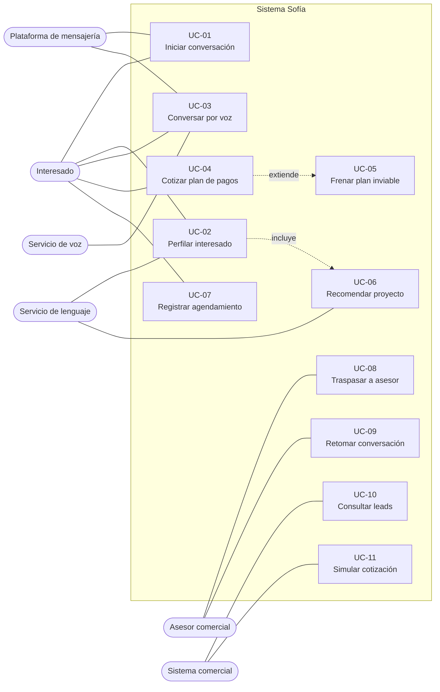

# 03 · Casos de uso

| | |
|---|---|
| **Identificador** | SOFIA-DOC-03 |
| **Versión** | 1.0 |
| **Fecha** | 2026-07-26 |
| **Estado** | Vigente |
| **Audiencia** | Equipo técnico, área comercial, evaluadores |
| **Documentos relacionados** | [01 · Visión general](01-VISION-GENERAL.md) · [02 · Arquitectura](02-ARQUITECTURA.md) · [04 · Diagramas](04-DIAGRAMAS.md) |

---

## 1. Alcance

Especifica el comportamiento observable del sistema desde la perspectiva de sus actores. Cada caso de uso declara precondiciones, flujo principal, flujos alternativos, postcondiciones y los requisitos que satisface, permitiendo trazabilidad entre lo especificado en [01 · Visión general](01-VISION-GENERAL.md) y lo implementado.

---

## 2. Actores

| Actor | Tipo | Descripción |
|---|---|---|
| **Interesado** | Primario, humano | Persona que busca vivienda. Interactúa exclusivamente por WhatsApp. No conoce el funcionamiento interno ni sabe que fue clasificado. |
| **Asesor comercial** | Primario, humano | Personal de Colsubsidio. Recibe leads calificados y puede tomar el control de una conversación. |
| **Sistema comercial** | Primario, sistema | Dashboard o CRM. Consume leads y solicita simulaciones. Se autentica con clave de servicio. |
| **Plataforma de mensajería** | Secundario, sistema | WhatsApp Business Cloud API. Entrega mensajes entrantes y transporta los salientes. |
| **Servicio de lenguaje** | Secundario, sistema | Genera la respuesta conversacional y extrae el perfil estructurado. |
| **Servicio de voz** | Secundario, sistema | Transcribe notas de voz y sintetiza respuestas habladas. |

---

## 3. Diagrama de casos de uso

---

## 4. Resumen

| ID | Caso de uso | Actor primario | Requisitos |
|---|---|---|---|
| UC-01 | Iniciar conversación desde anuncio | Interesado | RF-01 |
| UC-02 | Perfilar interesado durante la conversación | Interesado | RF-03, RF-04, RF-05 |
| UC-03 | Conversar por nota de voz | Interesado | RF-02 |
| UC-04 | Cotizar plan de pagos | Interesado | RF-06 |
| UC-05 | Frenar un plan fuera de capacidad de pago | Sistema | RF-07 |
| UC-06 | Recomendar proyecto según perfil | Interesado | RF-05 |
| UC-07 | Registrar intención de agendamiento | Interesado | RF-08 |
| UC-08 | Traspasar la conversación a un asesor | Asesor comercial | RF-09 |
| UC-09 | Retomar la conversación con el agente | Asesor comercial | RF-09 |
| UC-10 | Consultar leads perfilados | Sistema comercial | RF-10 |
| UC-11 | Simular una cotización | Sistema comercial | RF-06 |

---

## UC-01 · Iniciar conversación desde anuncio

| | |
|---|---|
| **Actor primario** | Interesado |
| **Actores secundarios** | Plataforma de mensajería, Servicio de lenguaje |
| **Disparador** | El interesado pulsa un anuncio Click-to-WhatsApp y envía el mensaje predefinido |
| **Precondiciones** | Webhook registrado y verificado. Servidor en ejecución. |
| **Postcondiciones** | Conversación creada e indexada por número de teléfono. El interesado recibió una respuesta. |

**Flujo principal**

1. El interesado pulsa el anuncio; se abre WhatsApp con un mensaje predefinido que nombra un proyecto.
2. El interesado envía el mensaje.
3. La plataforma entrega el evento al webhook con firma HMAC.
4. El sistema verifica la firma.
5. El sistema extrae el nombre del proyecto del texto del mensaje y crea el registro de conversación.
6. El sistema cruza el número contra la base de afiliados.
7. El sistema construye el contexto y solicita una respuesta al servicio de lenguaje.
8. El sistema envía la respuesta por WhatsApp, saludando por nombre y mencionando el proyecto.

**Flujos alternativos**

| # | Condición | Comportamiento |
|---|---|---|
| 1a | Firma inválida o ausente | Se responde `401`. El evento se descarta y se registra. |
| 5a | El mensaje no nombra ningún proyecto del catálogo | Se usa el proyecto predeterminado y el agente pregunta cuál interesa. |
| 6a | El número no existe en la base de afiliados | Se continúa sin datos previos. El agente debe descubrir si es afiliado. |
| 7a | El servicio de lenguaje falla | Se registra el error. El interesado no recibe respuesta automática. |

> **Nota de diseño.** Se eligió Click-to-WhatsApp en lugar de Lead Ads porque en Lead Ads el agente inicia el contacto, y eso obliga a usar plantillas pre-aprobadas por la plataforma. Con este formato el interesado envía el primer mensaje y el agente responde con texto libre desde el primer segundo.

---

## UC-02 · Perfilar interesado durante la conversación

| | |
|---|---|
| **Actor primario** | Interesado |
| **Actores secundarios** | Servicio de lenguaje |
| **Disparador** | Cualquier mensaje entrante del interesado |
| **Precondiciones** | Conversación existente |
| **Postcondiciones** | Señales actualizadas. Arquetipo recalculado. Cambios de perfil registrados con marca de tiempo. |

**Flujo principal**

1. El sistema extrae del texto del interesado —nunca del texto del agente— la edad, la composición familiar y los ingresos.
2. El sistema determina el proyecto de la conversación por la mención más reciente.
3. El sistema clasifica al interesado en un arquetipo mediante reglas explícitas.
4. Si el arquetipo cambió, se registra el cambio con turno y marca de tiempo.
5. El sistema construye el bloque de guion correspondiente al arquetipo.
6. El bloque se adjunta al contexto como segundo bloque de sistema, sin caché.
7. El agente responde aplicando el guion sin mencionarlo.

**Flujos alternativos**

| # | Condición | Comportamiento |
|---|---|---|
| 1a | Un dato ya conocido se declara distinto | Prevalece la mención más reciente y se registra la actualización. |
| 3a | Se desconoce la edad | Se aplica **modo neutral**: prohibido suponer hijos, pareja o situación de vida. La prioridad pasa a averiguar edad y con quién viviría. |
| 3b | El precio del proyecto supera el umbral de gama alta | Prevalece el arquetipo premium sobre el criterio de edad. |

**Reglas de negocio**

- La clasificación es determinística. El servicio de lenguaje no decide a qué arquetipo pertenece nadie.
- La extracción es conservadora: ante ambigüedad se prefiere no saber antes que suponer mal.
- El arquetipo nunca se le comunica al interesado.

---

## UC-03 · Conversar por nota de voz

| | |
|---|---|
| **Actor primario** | Interesado |
| **Actores secundarios** | Servicio de voz, Plataforma de mensajería |
| **Disparador** | El interesado envía una nota de voz |
| **Precondiciones** | Conversación existente. Servicio de voz disponible. |
| **Postcondiciones** | El interesado recibió una respuesta hablada. Los enlaces, si los hubo, llegaron aparte en texto. |

**Flujo principal**

1. El sistema recibe el evento con el identificador del audio.
2. El sistema descarga el audio desde la plataforma.
3. El servicio de voz lo transcribe.
4. La transcripción entra al flujo normal de conversación (UC-02).
5. El sistema indica al agente que la respuesta será escuchada: sin emojis, sin enlaces, sin viñetas, frases más cortas.
6. El agente genera la respuesta.
7. El sistema normaliza el texto para síntesis: remueve emojis y símbolos, y convierte unidades y montos a su forma hablada.
8. El servicio de voz sintetiza con voz de acento colombiano.
9. El sistema sube el audio y lo envía.
10. Si la respuesta contenía enlaces, se envían aparte en un mensaje de texto.

**Flujos alternativos**

| # | Condición | Comportamiento |
|---|---|---|
| 3a | La transcripción falla | Se pide al interesado que escriba el mensaje. |
| 7a | Tras la normalización no queda texto legible | No se genera audio; se responde por texto. |
| 8a | La síntesis falla | **Degradación correcta**: se responde por texto. La conversación no se interrumpe. |

**Reglas de negocio**

- Los motores de síntesis pronuncian los emojis por su nombre. La normalización previa no es opcional.
- Las cifras habladas llegan en palabras, no en dígitos. La interpretación debe contemplarlo.

---

## UC-04 · Cotizar plan de pagos

| | |
|---|---|
| **Actor primario** | Interesado |
| **Disparador** | El interesado solicita una cotización, o el agente llega al punto de ofrecerla |
| **Precondiciones** | Se conocen proyecto, precio, fecha de entrega e ingresos declarados |
| **Postcondiciones** | Plan calculado y disponible para el agente, con su evaluación de viabilidad |

**Flujo principal**

1. El sistema resuelve el proyecto de la conversación y obtiene precio y fecha de entrega.
2. El sistema calcula el plazo en meses hasta la entrega.
3. El sistema determina el tope de vivienda de interés social aplicable **según la ubicación del proyecto**.
4. El sistema calcula el subsidio según ingresos, tope y condiciones declaradas.
5. Según haya subsidio o no, se aplica el régimen correspondiente y se construye el cronograma.
6. El sistema calcula la carga financiera sobre el ingreso declarado.
7. El resultado se adjunta al contexto del agente.
8. El agente comunica las cifras en frases breves, aclarando que es una estimación.

**Flujos alternativos**

| # | Condición | Comportamiento |
|---|---|---|
| 1a | Falta el precio, la fecha de entrega o los ingresos | **No se cotiza.** Se remite a un asesor y se registra qué dato faltó. |
| 2a | El plazo resultante es cero o negativo | **No se cotiza.** La entrega ya venció; el cálculo produciría cifras sin sentido. |
| 4a | El precio supera el tope aplicable | Sin subsidio; se aplica el régimen alterno. |
| 4b | El interesado declara vivienda propia o subsidio previo | Sin subsidio, con el motivo explícito. |
| 6a | La carga supera el umbral configurado | Continúa en UC-05. |

**Reglas de negocio**

- Sin los tres datos no se estima. El plazo determina el régimen completo del plan.
- El tope de vivienda de interés social depende de la ubicación: un mismo precio puede calificar en una ciudad y no en un municipio.
- El agente nunca presenta una cifra como definitiva.

---

## UC-05 · Frenar un plan fuera de capacidad de pago

| | |
|---|---|
| **Actor primario** | Sistema |
| **Tipo** | Extensión de UC-04 |
| **Disparador** | La carga financiera calculada supera el umbral configurado |
| **Postcondiciones** | El plan queda marcado como no viable. El agente no lo presenta como cerrado. |

**Flujo principal**

1. El sistema marca el resultado como no viable y registra la carga calculada.
2. El sistema adjunta al contexto la instrucción de no presentarlo como plan cerrado.
3. El agente ofrece una tipología de menor valor del catálogo, o propone conectar con un asesor para armar un plan a la medida.
4. El agente no comunica el cálculo interno ni el umbral.

**Reglas de negocio**

- El agente **nunca** afirma que el interesado puede pagar una cuota que excede el umbral sobre su ingreso declarado.
- La alternativa se ofrece sin señalar al interesado como incapaz de pagar.

> **Justificación.** El cálculo replicado produce, en el régimen con subsidio, cuotas que superan el ingreso mensual del hogar. Ver [07 · Hallazgos](07-HALLAZGOS.md), sección 3.2. Apartarse de la fuente en este punto fue una decisión deliberada: reproducirla con fidelidad habría significado ofrecer planes impagables a quienes menos margen tienen.

---

## UC-06 · Recomendar proyecto según perfil

| | |
|---|---|
| **Actor primario** | Interesado |
| **Tipo** | Incluido en UC-02 |
| **Precondiciones** | Al menos siete de las diez dimensiones conocidas, **incluida la edad** |
| **Postcondiciones** | El interesado recibió una o dos recomendaciones con justificación |

**Flujo principal**

1. El sistema verifica que se conozca la edad. Es condición obligatoria.
2. El agente selecciona uno o dos proyectos del catálogo compatibles con el perfil.
3. El agente explica por qué convienen, destacando lo que el guion del arquetipo indica resaltar.
4. El agente omite deliberadamente lo que el guion indica callar.
5. El agente comparte material de apoyo del proyecto.
6. El agente ofrece conectar con un asesor.

**Flujos alternativos**

| # | Condición | Comportamiento |
|---|---|---|
| 1a | No se conoce la edad | Se interrumpe el flujo y se pregunta la edad antes de recomendar. |
| 2a | Ningún proyecto encaja con el presupuesto declarado | Se plantea con transparencia y se ofrecen las alternativas más cercanas. |

**Ejemplo de diferenciación**

| | Joven independiente | Familia consolidada |
|---|---|---|
| Resalta | cuota comparada con el arriendo actual, cesantías, coworking, movilidad | tercera habitación, zona infantil, colegios, seguridad |
| Omite | zona infantil, colegios, referencias a hijos futuros | discurso de inversión, urgencia |
| Tono | directo, cifras concretas | cálido, en segunda persona del plural |

---

## UC-07 · Registrar intención de agendamiento

| | |
|---|---|
| **Actor primario** | Interesado |
| **Disparador** | El agente propone coordinar contacto y el interesado acepta |
| **Postcondiciones** | Modalidad, día y franja registrados en el perfil del lead |

**Flujo principal**

1. El agente nombra qué le entregará el asesor y propone coordinar.
2. El interesado indica su disponibilidad.
3. El agente confirma lo registrado sin prometer una hora confirmada.
4. El sistema persiste la intención en el perfil.
5. El dato queda disponible para el sistema comercial.

**Flujos alternativos**

| # | Condición | Comportamiento |
|---|---|---|
| 2a | El interesado declina | Se continúa la conversación sin insistir. |
| 2b | Indica día pero no franja | Se registra lo disponible y se pregunta la franja si fluye. |

> **Limitación conocida.** El sistema registra la intención pero **no escribe en la agenda real** de los asesores. La integración correspondiente está en especificación.

---

## UC-08 · Traspasar la conversación a un asesor

| | |
|---|---|
| **Actor primario** | Asesor comercial, a través del sistema comercial |
| **Disparador** | El asesor decide intervenir |
| **Precondiciones** | Conversación existente. Petición autenticada. |
| **Postcondiciones** | El agente deja de responder. Los mensajes del interesado se siguen registrando. |

**Flujo principal**

1. El sistema comercial invoca el endpoint de traspaso con clave de servicio.
2. El sistema marca la conversación como atendida por un humano.
3. El agente deja de generar respuestas para ese número.
4. Los mensajes entrantes se siguen guardando en el historial.
5. El asesor puede enviar mensajes a través del endpoint correspondiente.

**Flujos alternativos**

| # | Condición | Comportamiento |
|---|---|---|
| 1a | Petición sin clave o con clave inválida | Se responde `401`. |
| 1b | El número no tiene conversación registrada | Se responde con error descriptivo. |

---

## UC-09 · Retomar la conversación con el agente

| | |
|---|---|
| **Actor primario** | Asesor comercial |
| **Precondiciones** | Conversación en estado atendida por humano |
| **Postcondiciones** | El agente vuelve a responder, conservando el historial completo |

**Flujo principal**

1. El sistema comercial invoca el endpoint de retorno con clave de servicio.
2. El sistema marca la conversación como atendida por el agente.
3. El siguiente mensaje del interesado se procesa con el flujo normal.
4. El agente dispone del historial completo, incluidos los mensajes del asesor.

---

## UC-10 · Consultar leads perfilados

| | |
|---|---|
| **Actor primario** | Sistema comercial |
| **Precondiciones** | Petición autenticada con clave de servicio |
| **Postcondiciones** | El sistema comercial obtiene el listado con perfil y contexto |

**Flujo principal**

1. El sistema comercial solicita el listado con la cabecera de autenticación.
2. El sistema valida la clave en tiempo constante.
3. El sistema devuelve los leads con perfil, arquetipo aplicado, historial de cambios de perfil e intención de agendamiento.

**Flujos alternativos**

| # | Condición | Comportamiento |
|---|---|---|
| 2a | Clave ausente o inválida | Se responde `401` y se registra el intento con ruta y origen. |
| 2b | Se supera el límite de tasa | Se responde `429` con indicación de reintento. |

> **Limitación conocida.** Un lead entra al listado cuando el agente emite el perfil estructurado, lo que ocurre al llegar a un cierre natural de conversación. Las conversaciones abandonadas a medias quedan guardadas pero no aparecen. Son precisamente las que más valdría rescatar. La corrección propuesta es crear el registro desde el primer mensaje y actualizarlo en cada turno, con campos de estado y completitud.

---

## UC-11 · Simular una cotización

| | |
|---|---|
| **Actor primario** | Sistema comercial |
| **Precondiciones** | Petición autenticada |
| **Postcondiciones** | Se obtiene el plan de pagos con su evaluación de viabilidad |

**Flujo principal**

1. El sistema comercial envía precio, fecha de entrega, ingresos y, opcionalmente, ubicación y condiciones de subsidio.
2. El sistema aplica la misma lógica que usa el agente.
3. Se devuelve régimen aplicado, subsidio, cuota, cronograma, carga financiera y viabilidad.

**Flujos alternativos**

| # | Condición | Comportamiento |
|---|---|---|
| 1a | Faltan precio o fecha de entrega | Se responde `400` indicando los campos ausentes. |
| 2a | La fecha de entrega ya venció | Se devuelve el resultado como no cotizable con el motivo. |

> Permite al asesor simular escenarios desde el sistema comercial sin abrir el cotizador externo, usando exactamente la misma lógica que vio el interesado.

---

## 5. Trazabilidad

| Requisito | Casos de uso |
|---|---|
| RF-01 | UC-01 |
| RF-02 | UC-03 |
| RF-03 | UC-02 |
| RF-04 | UC-02 |
| RF-05 | UC-02, UC-06 |
| RF-06 | UC-04, UC-11 |
| RF-07 | UC-05 |
| RF-08 | UC-07 |
| RF-09 | UC-08, UC-09 |
| RF-10 | UC-10 |

---

## 6. Control de versiones

| Versión | Fecha | Cambio |
|---|---|---|
| 1.0 | 2026-07-26 | Versión inicial |
