# 04 · Diagramas

| | |
|---|---|
| **Identificador** | SOFIA-DOC-04 |
| **Versión** | 1.0 |
| **Fecha** | 2026-07-26 |
| **Estado** | Vigente |
| **Audiencia** | Equipo técnico, evaluadores |
| **Documentos relacionados** | [02 · Arquitectura](02-ARQUITECTURA.md) · [03 · Casos de uso](03-CASOS-DE-USO.md) |

---

## 1. Alcance

Representación gráfica de la estructura y el comportamiento del sistema. Los diagramas están escritos en Mermaid, que se renderiza de forma nativa en la vista de GitHub.

| Sección | Diagrama | Responde a |
|---|---|---|
| 2 | Contexto | Con qué se relaciona el sistema |
| 3 | Capas y componentes | Cómo está organizado por dentro |
| 4 | Flujo de un mensaje | Qué ocurre en cada turno |
| 5 | Secuencia: texto | Cómo colaboran los componentes |
| 6 | Secuencia: voz | Qué cambia en el canal hablado |
| 7 | Decisión: clasificación | Cómo se determina el arquetipo |
| 8 | Decisión: cotización | Cuándo se cotiza y cuándo no |
| 9 | Estados de conversación | Ciclo de vida de una conversación |
| 10 | Estados de un lead | Ciclo de vida de un lead |
| 11 | Modelo de datos | Qué se persiste |
| 12 | Controles de seguridad | Qué atraviesa cada petición |

---

## 2. Diagrama de contexto

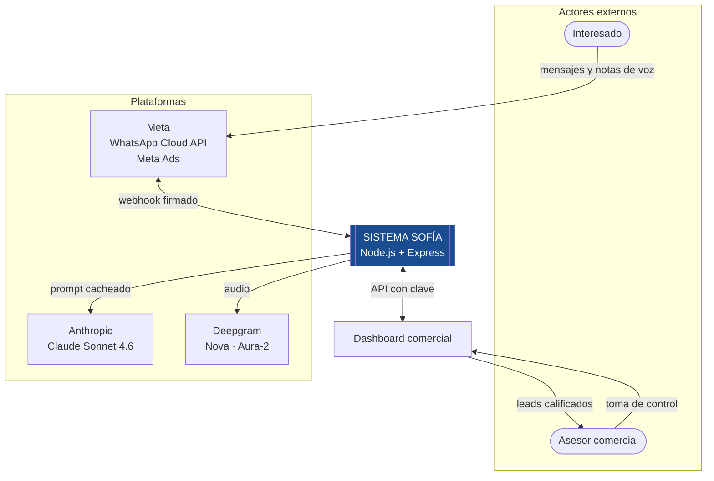

---

## 3. Capas y componentes

El sistema sigue una separación por capas que se corresponde con el patrón modelo–vista–controlador, con la particularidad de que la vista principal es una conversación y no una interfaz gráfica.

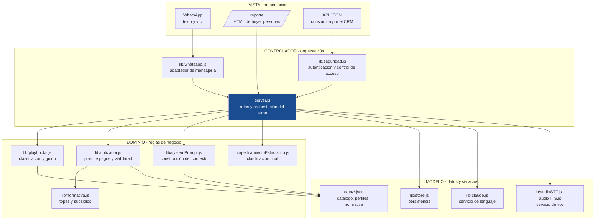

### 3.1 Correspondencia con el patrón

| Capa | Responsabilidad | Módulos |
|---|---|---|
| **Vista** | Presentación al actor. La principal es la conversación de WhatsApp; existen además una vista HTML de reportes y una representación JSON para el sistema comercial. | WhatsApp, `/reporte`, `/api/*` |
| **Controlador** | Recibe la petición, aplica control de acceso, orquesta la secuencia del turno y decide qué se devuelve. No contiene reglas de negocio. | `server.js`, `seguridad.js`, `whatsapp.js` |
| **Dominio** | Reglas del negocio: cómo se clasifica un interesado, cómo se calcula un plan, qué normativa aplica. Independiente del transporte. | `playbooks.js`, `cotizador.js`, `normativa.js`, `perfilamientoEstadistico.js`, `systemPrompt.js` |
| **Modelo** | Datos persistidos y acceso a servicios externos. | `store.js`, `data/*.json`, `claude.js`, `audioSTT.js`, `audioTTS.js` |

### 3.2 Observación sobre la aplicación del patrón

La correspondencia es real pero no literal. Un sistema conversacional no tiene una vista renderizada por el servidor en el sentido clásico: la salida es texto o audio que interpreta una aplicación de terceros.

Lo que sí se preserva es la propiedad que hace útil al patrón: **el dominio no conoce el transporte.** `cotizador.js` calcula planes sin saber que existe WhatsApp, y `playbooks.js` clasifica sin saber que hay un modelo de lenguaje detrás. Ambos son verificables de forma aislada, y así se verificaron contra las cotizaciones oficiales.

---

## 4. Flujo de un mensaje

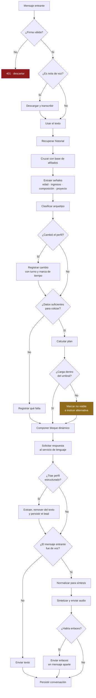

---

## 5. Secuencia · conversación por texto

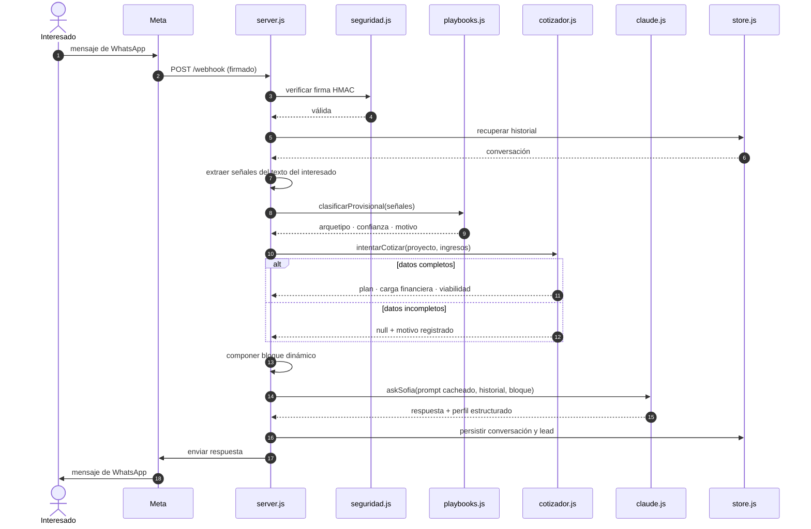

---

## 6. Secuencia · conversación por voz

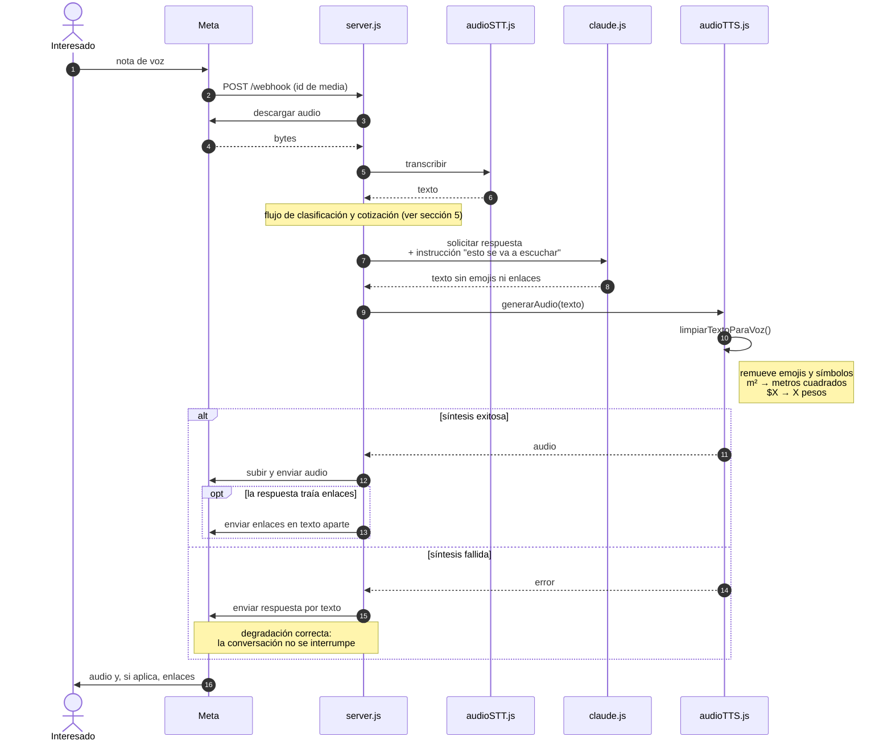

---

## 7. Decisión · clasificación en arquetipo

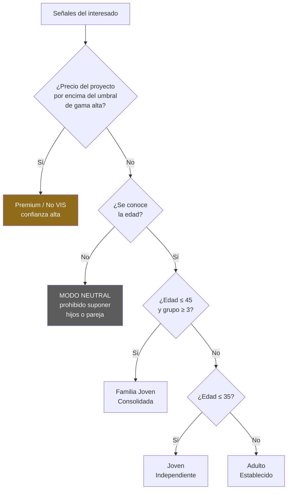

El orden de evaluación no es arbitrario: el precio prevalece sobre la edad porque un proyecto de gama alta define el comportamiento de compra con más fuerza que el rango etario. Y sin edad no se clasifica: es la variable que separa los conglomerados.

---

## 8. Decisión · cotización

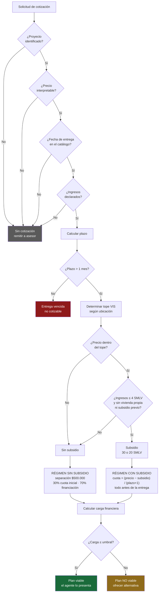

---

## 9. Estados de una conversación

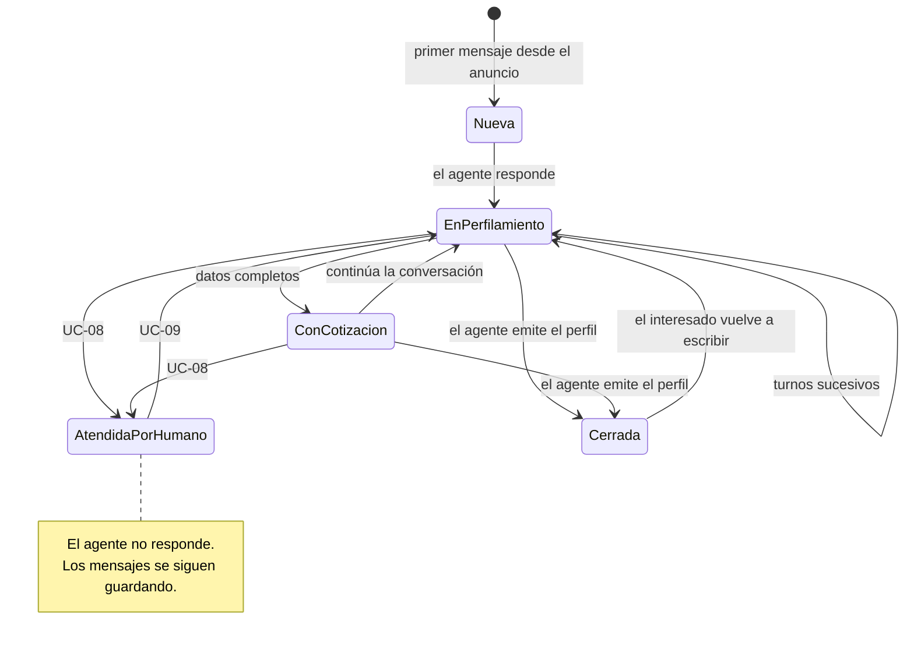

---

## 10. Estados de un lead

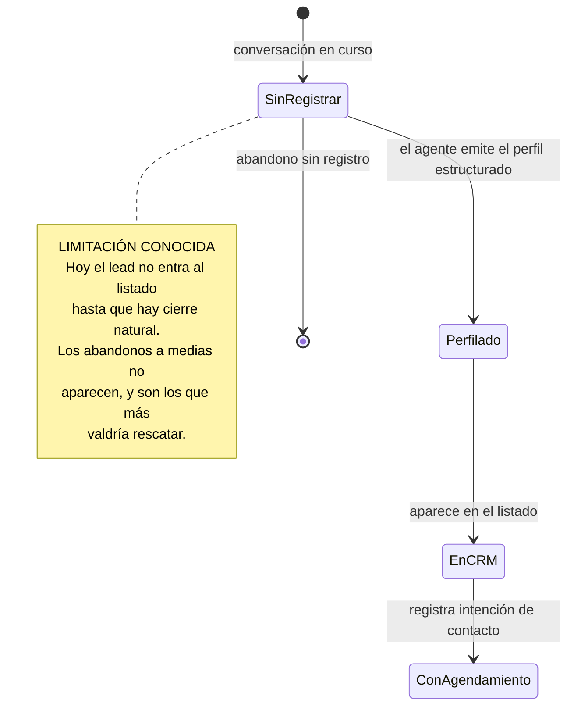

---

## 11. Modelo de datos

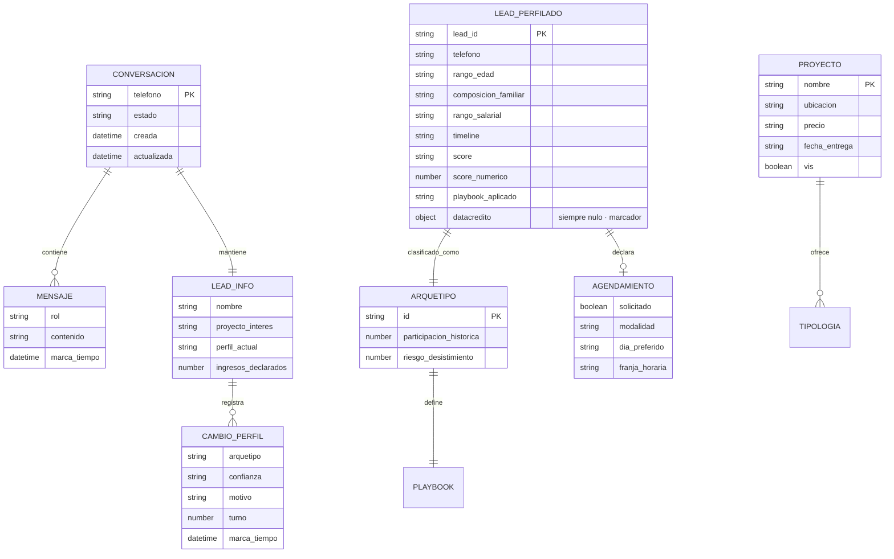

> `datacredito` existe como marcador de integración futura y **siempre es nulo**. No se consulta ni se infiere información crediticia. Ver [06 · Seguridad](06-SEGURIDAD.md), sección 5.2.

---

## 12. Controles de seguridad por petición

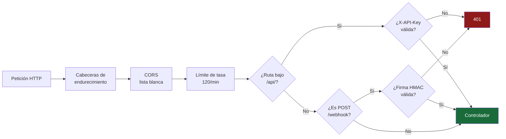

La comparación de la clave se hace en tiempo constante y la firma se verifica sobre el cuerpo crudo de la petición. El detalle y su justificación están en [06 · Seguridad](06-SEGURIDAD.md), sección 3.

---

## 13. Control de versiones

| Versión | Fecha | Cambio |
|---|---|---|
| 1.0 | 2026-07-26 | Versión inicial |
